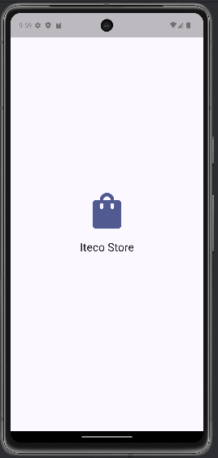
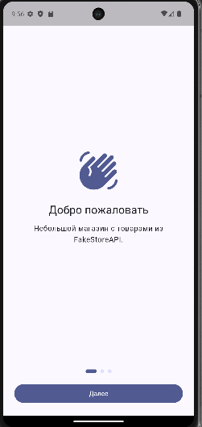
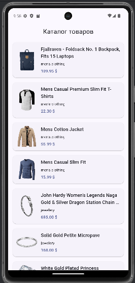

# Iteco Test App

Тестовое Flutter-приложение с простым пользовательским сценарием:
`Splash` -> `Onboarding` -> `Feed` товаров.

Источник данных: [FakeStoreAPI](https://fakestoreapi.com/).

## Возможности

- Splash-экран с автоматическим переходом на онбординг
- Онбординг на `PageView` с индикатором текущего шага
- Лента товаров с карточками (название, цена, категория, рейтинг)
- Pull-to-refresh для ручного обновления ленты
- Пагинация при прокрутке (infinite scroll)
- Автодозагрузка данных, если первого экрана товаров недостаточно для скролла

## Технологии

- `Flutter`
- `Dart`
- `Dio` для HTTP-запросов
- `ChangeNotifier` + `AnimatedBuilder` для управления состоянием
- MVVM + элементы Clean Architecture

---

## Архитектура

Проект реализован с использованием **MVVM** и принципов **Clean Architecture**.

### Разделение на слои:

- **domain**
    - бизнес-сущности
    - интерфейсы репозиториев
    - use cases

- **data**
    - работа с API
    - модели данных
    - реализации репозиториев

- **presentation**
    - UI (экраны и виджеты)
    - ViewModel
    - управление состоянием

Такой подход обеспечивает:
- масштабируемость
- удобство тестирования
- слабую связанность компонентов

---

## Архитектурные решения

- MVVM выбран для разделения UI и бизнес-логики
- Clean Architecture используется для масштабируемости и тестируемости
- ChangeNotifier выбран как легковесное решение для state management

## Структура проекта

```text
lib/
  main.dart
  src/
    app.dart
    data/
      datasources/
      models/
      repositories/
    domain/
      entities/
      repositories/
      usecases/
    presentation/
      views/
      viewmodels/
      widgets/
```

## Архитектурный подход

Проект разделен на три слоя:

- `domain` — бизнес-сущности и контракты
- `data` — работа с сетью, модели и реализации репозиториев
- `presentation` — UI, состояния экранов и переиспользуемые виджеты

Такое разделение упрощает поддержку, тестирование и расширение приложения.

## Запуск проекта

### Требования

- Flutter SDK (актуальная стабильная версия)
- Dart SDK (ставится вместе с Flutter)
- Android Studio / VS Code + эмулятор или реальное устройство

### Установка и запуск

```bash
flutter pub get
flutter run
```

### Сборка

```bash
flutter build apk
```

### Проверка окружения

```bash
flutter doctor
```


## Полезные команды

```bash
flutter analyze
flutter test
flutter build apk
```

## Скриншоты

### Splash


### Onboarding


### Feed


